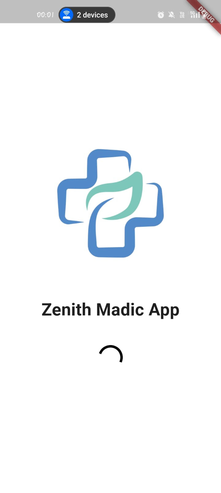
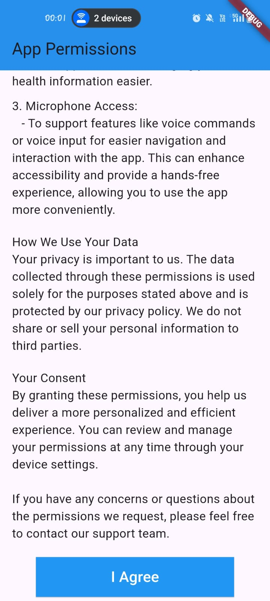
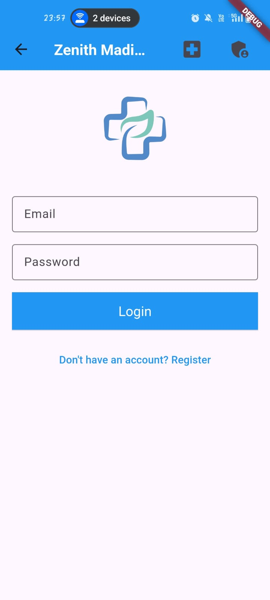
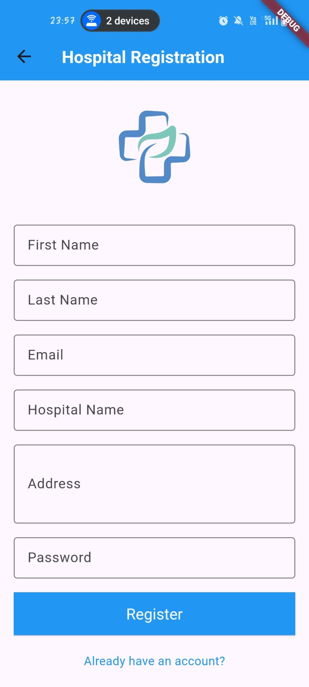
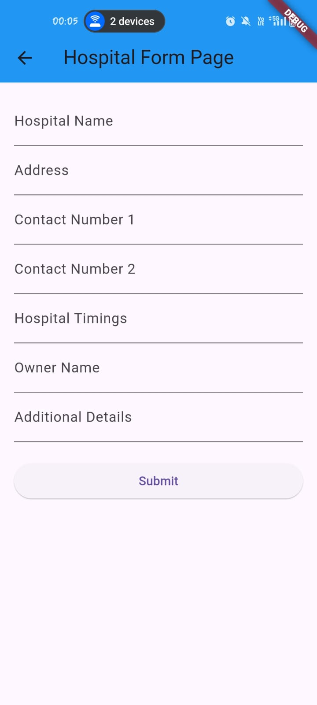
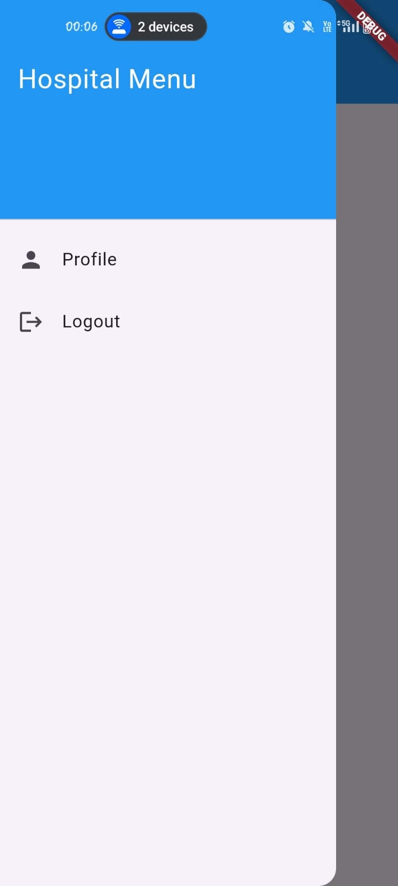

# Hospital Department Information Management System (HDIMS)

This project is a **Hospital Department Information Management System** built using **Flutter** for the frontend and integrates with Firebase for backend services. It includes features such as hospital department management, profile management, and secure user authentication.

## Table of Contents

- [Features](#features)
- [Installation](#installation)
- [Usage](#usage)
- [Project Structure](#project-structure)
- [Technologies Used](#technologies-used)
- [Screenshots](#screenshots)
- [Contributing](#contributing)
- [License](#license)

## Features

- Hospital department management
- User authentication (Profile, Logout)
- Detailed hospital information form
- Profile page displaying hospital details
- Integration with Firebase
- Simple navigation drawer for menu
## Image
<div style="display: flex; justify-content: space-around;">
  
  
   
   
   
   
   
   
</div>

## Installation

To run this project locally, follow these steps:

1. **Clone the repository**:
   ```bash
   git clone https://github.com/Vishnu8299/SIH-1626-HDIMS.git
